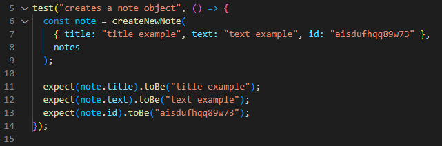

# Note Taker 

## Description
Note Taker is web application that you can use to keep track of lists, reminders, and other notes. The notes are saved to a server so they can be accessed from anywhere with an internet connection.

## Table of Contents
* [Usage](#usage)
* [Contributing](#contributing)
* [Tests](#tests)
* [Questions](#questions)
* [Deployed Application](#deployed-application)

## Usage
Click 'Get Started' on the homepage to access the list of notes.

Click the '+' symbol in the top right corner of the screen to add a note and type your note's title and text into the open fields. Once you've completed your note, click the save icon in the top right corner of the window to save it.

The note will then appear on the left side of the window with the rest of the notes. Any note can be edited by clicking on it, which will open it up in the right column again. To save your changes, click the save icon again. Any note can be deleted by clicking on the red trash can icon next to that note ('note 2' was deleted in the picture below).

## Contributing
This is an open source project and as such, please follow the [Contributor Covenant](https://www.contributor-covenant.org/).

## Tests
Tests for each function were created and ran successfully as shown below.

The following 2 images show the code for 2 of those 5 function tests. `createNewNote()` and `findById()` both work as expected.

## Questions
Check out my GitHub profile [here!](https://www.github.com/spaghettimedic) I can be reached directly at dsteiner247@gmail.com should you have any questions.

## Deployed Application
https://spaghettimedic-note-taker.herokuapp.com/